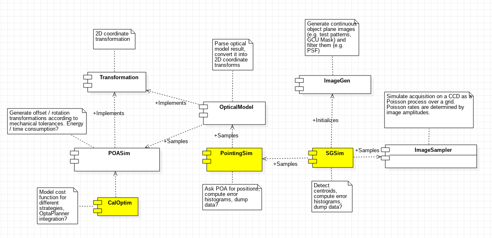

# harmoni-pm: Architecture and implementation
This document intends to be the reference guide for `harmoni-pm` internals, including architerctural details, implementation, WIP, limitations and TODO.

## Project overview
`harmoni-pm`is a Python 3 project that comprises both the`harmoni_pm`package and the command line tools necessary to perform the different simulation tasks over HARMONI's pointing model. The ultimate goal of this project is to validate the requirement R-HRM-153 that states that _he WCS of each spaxel shall be known to within 1.0 spatial resolution element_, which translates to an overall error budget 10 mas. This error budget will be splitted in three main groups:

* Any spaxel with respect to the IFU's field centre (dominated by calibration incertitudes)
* The IFU field centre itself with respect to the NGS reference pixel (this is dominated by NGSS mechanisms, the IFS derotator and other IFU mechanisms)
* The NGS reference pixel within the focal plane (this is dominated by optical effects and calibration errors).

The simulation will take into account mechanical tolerances, optical aberrations and other effects used as an input in order to quantify the uncertainty of the knowledge of the spaxel position via Monte Carlo testing. 

The primary user interface of this project will be a set of command-line applications configured either via command line arguments or configuration files that will produce different simulation products, either in the form of human readable text or as formatted data files.  The system-wide availability of the core package`harmoni_pm`is also contemplated.

`harmoni-pm`also aims to become the foundation of a more sophisticated simulation tool that takes other effects that were not initially taken into account in its earlier versions. In order to achieve this goal, a good software architecture is critical.

## Source tree and directory structure
The source tree is currently hosted in the [LAM](https://lam.fr)'s gitlab repository at `git@gitlab.lam.fr:harmoni/harmoni-sandbox/pointing-model.git`. The development branch is named `develop`.

Source files are organized according directory structure that attempts to reflect the component architecture described in the next section. The current directory structure is as follows:

<pre>
├── doc                   Documentation directory
│   └── design            Software design documents
└── harmoni_pm            Python package directory
    ├── common            Common API and utility classes
    ├── imagegen          Definition of image planes as intensity maps
    ├── imagesampler      Simulation of the behaviour of a CCD
    ├── optics            Optical model goes here
    ├── poasim            Pick Off Arm-related classes
    └── transform         Coordinate transform between image planes
</pre>

## Architecture overview
The first step performed during the design phase was to identify the different software components that would conform the final project. The components identified during the design phase, along with their depencies, are illustrated below. Components refering to command line tools are highlighted in yellow.

<center></center>

### The Common component
The common component represents the set of generic utility classes used across the project, like float array, exceptions and quantities.

#### `FloatArray`
```python
class FloatArray(numpy.ndarray)
```
Convenience subclass of `numpy.ndarray` with helper methods that ensures all arrays created from miscellaneous Python objects like tuples or lists are of the same `ARRAY_TYPE` type. Currently, `ARRAY_TYPE` is defined as `float32`, giving a 24-bit significand (slightly more than 7 decimals of precission).

 This class also provides a unified way to define tensors in `harmoni-pm`
<p />
<p />

```python
FloatArray.__init__(shape, buffer = None, offset = 0, strides = None, order = None)
```
Constructor of `FloatArray`. Parameters are that of the underlying `numpy.ndarray` constructor with `dtype` set to `ARRAY_TYPE`.
<p />
<p />

```python
@staticmethod
FloatArray.make(lst)
```
Factory method that instantiates a `FloatArray` from a given Python list or tuple specified by `lst`. This `lst` is passed directly to the underlying `numpy.ndarray` constructor, and therefore the usual list/tuple - `numpy.ndarray` conversion rules apply.
<p />
<p />

```python
@staticmethod
FloatArray.compatible_with(arr)
```

Returns `True` if `arr` is derived from `numpy.ndarray` and its `dtype` is set to `ARRAY_TYPE`. Otherwise, return false.

#### `Configuration`
#### `InvalidPrototypeError`
#### `InvalidTensorShapeError`
#### `QuantityType`

### The Transformation component
The Transformation component provides the abstraction to handle coordinate transforms between conjugate planes, assuming Gaussian optics (i.e. diffractive effects are ignored and must be modeled separately). Under this approximation, transforms are just $\mathbb R^2\to\mathbb R^2$ functions between coordinates.

Something as simple as a telescope with a given focal length can be modeled as a coordinate transform that multiplies the input coordinates by the inverse of the focal length. The following clases belong to the Transformation component:

<center></center>

Transforms are bi-directional, with the forward direction being that that transforms object plane coordinates into image plane coordinates, and the backward direction that that transforms image plane coordinates into object plane coordinates. Although theoretically $T_b=T_f^{-1}$ and therefore $T_b\circ T_f=\mathbb I$, this is rarely achievable in the real world. In practical terms, it is required that the composition of the same transform in both backward and forward directions equals the identity transform up to certain (hopefully small) numerical error:

$$
T_f\circ T_b=\mathbb I+e_{fb}
$$

#### `Transform`
```python
class Transform()
```
This is the abstract class from which all other coordinate transforms are derived. If instatiated directly, it represents the identity transform. Transforms accept tuples of the form $(x, y)$ or $N\times2$ `FloatArray` arrays representing sets of $N$ coordinates.
<p />
<p />

```python
Transform._forward(xy)
```
Protected method that computes the forward transform over the `ARRAY_TYPE` tuple `xy` and returns a $1\times2$ `FloatArray` containing the transformed coordinates. Non-trivial derivations of `Transform` must override at least `_forward` and `_backward`.
<p />
<p />

```python
Transform._backward(xy)
```
Protected method that computes the backward transform over the `ARRAY_TYPE` tuple `xy` and returns a $1\times2$ `FloatArray` containing the transformed coordinates. Non-trivial derivations of `Transform` must override at least `_forward` and `_backward`.
<p />
<p />

```python
Transform._forward_matrix(matrix)
```
Protected method that performs $N$ forward coordinate transforms all at once over the coordinate list `matrix` in the form of a $N\times2$ `FloatArray` and returns the transformed coordinate list as another $N\times2$ `FloatArray`. If not overriden by the subclass, this method simply applies `_forward` along the $N$ rows of `matrix`.
<p />
<p />

```python
Transform._backward_matrix(matrix)
```
Protected method that performs $N$ backward coordinate transforms all at once over the coordinate list `matrix` in the form of a $N\times2$ `FloatArray` and returns the transformed coordinate list as another $N\times2$ `FloatArray`. If not overriden by the subclass, this method simply applies `_backward` along the $N$ rows of `matrix`.
<p />
<p />

```python
Transform.forward(xy = None, x = None, y = None)
```
Public method that performs a forward transform, accepting either two scalar coordinates `x` and `y` or a tuple / `FloarArray` of coordinates in `xy`. The method automatically determines whether to use `_forward` of `_forward_matrix` according to the arguments passed to it.
<p />
<p />

```python
Transform.backward(xy = None, x = None, y = None)
```
Public method that performs a forward transform, accepting either two scalar coordinates `x` and `y` or a tuple / `FloarArray` of coordinates in `xy`. The method automatically determines whether to use `_backward` of `_backward_matrix` according to the arguments passed to it.
<p />
<p />

```python
Transform.generate()
```
In case the transform is derived from a set of parameters with uncertainties (e.g. mechanical tolerances, misalignments, precission limits in measurements), this method is called during Monte Carlo testing to initialize the specific transform parameters by drawing a sample from each parameter distribution.
<p />
<p />

```python
Transform.reset()
```
In case the transform holds a state (e.g. energy consumed during operation, time variation of the parameter distributions, etc), this method sets any internal state variables to their initial values.
<p />
<p />
#### `CompositeTransform`
```python
class CompositeTransform(Transform)
```
The `CompositeTransform` represents a chain of transforms $T_{1}$, $T_{2}, ... ,T_{n}$ that are applied sequentially according to the transform direction. If $T_1$ represents the coordinate transform between the object plane and the rest of the chain and $T_n$ the transform between the rest of the chain and the object plane, the forward composite transform is simply $T_{cf}=T_{nf}\circ \dots \circ T_{2f}\circ T_{1f}$. The backward transform will be $T_{cb}=T_{cf}^{-1}=(T_{nf}\circ \dots \circ T_{2f}\circ T_{1f})^{-1}=T_{1f}^{-1}\circ T_{2f}^{-1}\circ \dots \circ T_{nf}^{-1}=T_{1b}\circ T_{2b}\circ \dots \circ T_{nb}$.

```python
CompositeTransform.push_front(T)
```
Puts the transform `T` in the frontmost position of the transform chain, becoming the first transform to be computed in the forward direction.
<p />
<p />

```python
CompositeTransform.push_front(T)
```
Puts the transform `T` in the backmost position of the transform chain, becoming the first transform to be computed in the backward direction.
<p />
<p />
#### `TransformTester`
```python
class TransformTester()
```
As new transforms are expected to be implemented in the future, a tester class `TransformTester` with transform debugging functions is provided. `TransformTester` is instantiated from a given transform $T$ generates a set of coordinates, either from a regular grid or a set of stars in the sky up to certain visual magnitude. Then, these coordinates can be transformed multiple times in both directions by applying $T$ through the tester API. Finally, the tester API also allows the user to measure how much the resulting coordinates deviate from the departure coordinates and produce image files representing these deviations. 

<center>
<small><em>Images produced by `TransformTester` using a regular grid of points (left) and stars in the sky (right)</em></small></center>

```python
TransformTester.__init__(T)
```
Constructor for `TransformTester`. The argument `T` is the `Transform` object to be tested.
<p />
<p />

```python
TransformTester.generate_stars(ra, dec, ra_width, dec_width, maglimit)
```
Initializes the departure coordinates from a set of stars in the sky enclosed in a rectangle centered in right ascension `ra` and declination `dec`, and dimensions `ra_width x dec_width` (both of them in degrees) up to magnitude `maglimit`. Right ascension is encoded in the $x$ coordinate and declination in the $y$ coordinate.
<p />
<p />

```python
TransformTester.generate_points(width, height, delta_x, delta_y)
```
Initializes the departure coordinates from a set of equally spaced points, assuming a rectangle of size `width x height` with a `delta_x` separation in the horizontal dimension and `delta_y` separation in the vertical dimension.
<p />
<p />

```python
TransformTester.forward()
```
Applies the transform `T` to the current coordinates in the forward direction and replaces them by the result of the transform.
<p />
<p />

```python
TransformTester.backward()
```
Applies the transform `T`to the current coordinates in the forward direction and replaces them by the result of the transform.
<p />
<p />

```python
TransformTester.backfeed()
```
Replaces the departure coordinates by the current coordinates, effectively behaving as if the tester departure points were generated from the current state.
<p />
<p />
```python
TransformTester.sample()
```
Call `T.generate()` in order to sample the parameter distribution of the transform.
<p />
<p />

```python
TransformTester.distortion_rms()
```
Returns the root-mean-square value of the difference between the current coordinates and the departure coordinates. This value is computed as:

$$
E = \left[\frac{1}{N}\sum_{i=1}^N (x_i-\tilde{x}_i)^2+(y_i-\tilde{y}_i)^2\right]^{1/2}
$$

With $(x_i, y_i)$ the departure coordinates and $(\tilde{x}_i,\tilde{y}_i)$ the current (potentially transformed) coordinates.
<p />
<p />

```python
TransformTester.save_to_image(path)
```
Produce an image describing the result of the transformation with respect to the departure points, along with technical information like the exact sequence of applied transformations and the transform RMS.
