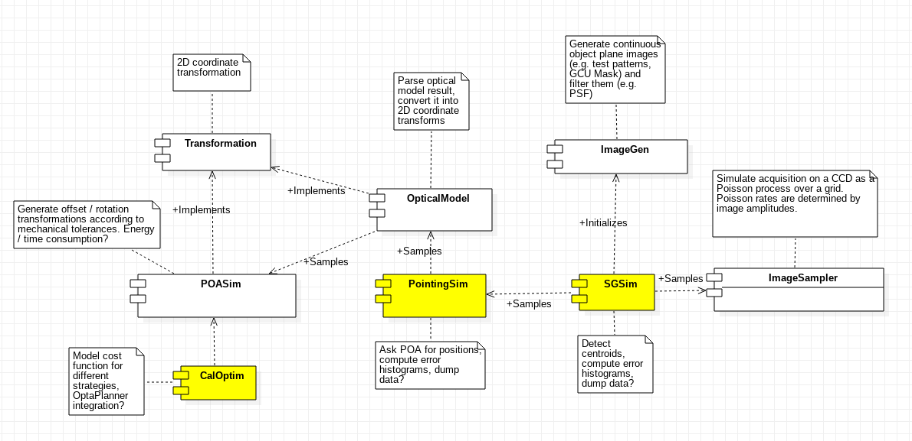

Architecture
============
The first step performed during the design phase was to identify the different software components that would conform the final project. The components identified during the design phase, along with their depencies, are illustrated below. Components referring to command line tools are highlighted in yellow.

.. include:: common.rst
.. include:: transform.rst
.. include:: imagegen.rst
.. include:: optics.rst
.. include:: imagesampler.rst
	     
