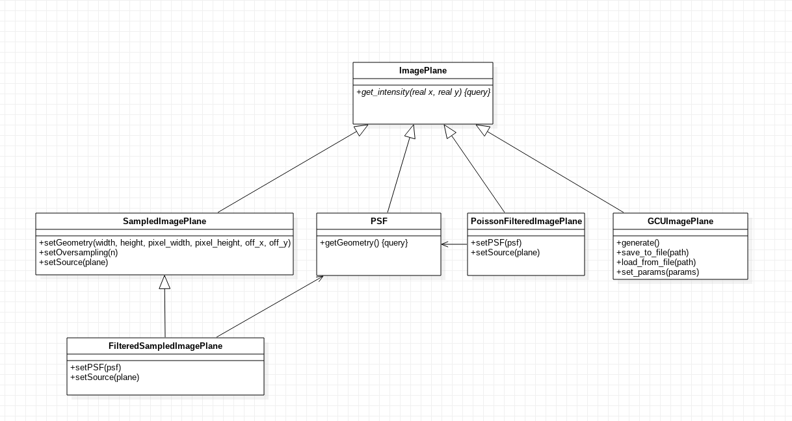

ImageGen
^^^^^^^^
The ImageGen component provides an abstraction for images both in the sky and the focal plane called *Image Planes* indistinctively. In this context, an Image Plane is simply a radiative intensity field :math:`I(\vec{q}): \mathbb R^2\to\mathbb R`, where :math:`\vec{q}=(\alpha,\delta)` if the field describes objects in the sky, or :math:`\vec{q}=(x,y)` if the field refers to the intensity in the focal plane.

Image planes are transformed by the optical model and sampled by :code:`ImageSampler`, which takes into account focal distances, obstructions, entrance pupils, etc. and determines not only how much light arrives to the focal plane, but also how sky coordinates are translated into focal plane coordinates and the intensity is converted into flux.

The intensity returned by image planes, as well as of the rest of magnitudes handled internally by :code:`harmoni-pm`, has SI units (:math:`\text{J m}^{-2}\text{sr}^{-1}\text{s}^{-1}\text{Hz}^{-1}`).

.. class:: ImagePlane()

   Base class for all implementations of image planes.

   .. abstractmethod:: get_intensity(x, y)
		       
      Intensity of the image plane at coordinates :math:`(x, y)`. If the intensity map refers to an object plane placed at infinity, coordinates must be specified in radians. Otherwise, coordinates must be in meters.

.. class:: GCUImagePlane(params = None)
	   
   Specialization of :code:`ImagePlane` that attempts to reproduce the intensity map of a regular grid of homogeneously-illuminated circles, mimicking the GCU mask of the instrument. If specified, :code:`params` is a dictionary whose keys describe parameters to be adjusted. Unrecognized parameters are ignored. Accepted parameters are:
   
      * :code:`point.separation`: separation of the circle centers in both dimensions (:math:`\text{m}`). Default: :math:`15\times10^{-3}`
      * :code:`point.diameter`: diameter of each circle (:math:`\text{m}`). Default: :math:`150\times10^{-6}`
      * :code:`point.intensity`: intensity of each circle (:math:`\text{J m}^{-2}\text{sr}^{-1}\text{s}^{-1}\text{Hz}^{-1}`). Default: :math:`10^{-3}`
      * :code:`point.x0`: horizontal displacement of the mask (:math:`\text{m}`). Default: :math:`0`
      * :code:`point.y0`: vertical displacement of the mask (:math:`\text{m}`). Default: :math:`0`
      * :code:`mask.diameter`: diameter of the mask (:math:`\text{m}`). Default: :math:`0.4`
	
   .. method:: generate()
	       
      Initialize the GCU by drawing random samples from its parameter distributions.

   .. method:: save_to_file(path)
	       
      Save parameters to a file.

   .. method:: load_from_file(path)
	       
      Retrieve parameters from a file.

      
   .. method:: set_params(params)
	       
      Updates the GCU parameters according to the dictionary specified in :code:`params` (see constructor for details).
      
