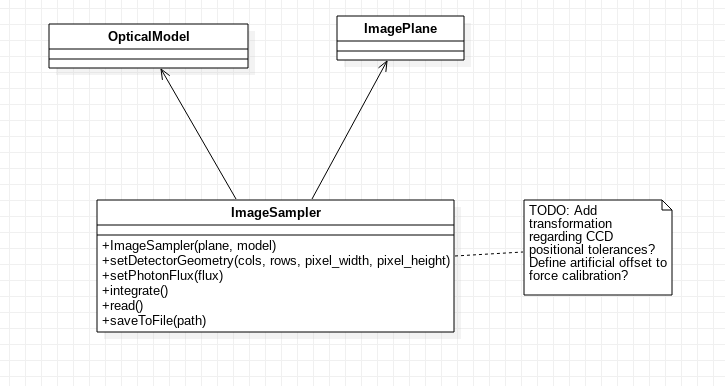

ImageSampler
^^^^^^^^^^^^
The :code:`ImageSampler` component attempts to reproduce the image acquired by a CCD assuming an intensity field given by an :code:`ImagePlane` object is placed in the entrance pupil of the optical model described by an :code:`OpticalModel` object, simulating the image produced by the instrument. The :code:`ImageSampler` is also in charge of translating the input intensity map into a flux map that can be used to integrate the image in the CCD. 

.. class:: ImageSampler(plane, model)

   Initializes the ``ImageSampler`` main object, from a given sky/mask ``ImagePlane`` as first argument and ``OpticalModel`` as second argument. The ``ImageSampler`` is set with a default oversampling value of ``HARMONI_IMAGE_SAMPLER_OVERSAMPLIGN`` (currently 8). Parallelization is set to true by default.

   .. method:: set_oversampling(oversampling)

      Sets the oversampling value to ``oversampling``. This operation triggers the precalculation of all intermediate data like the coordinate offset matrices and the CCD matrix.

   .. method:: set_geometry(cols, rows, delta_x, delta_y, finv = 1)

      Sets the geometry of the CCD to ``cols`` columns wide, ``rows`` rows tall, and with pixel sizes ``delta_x`` x ``delta_y``, both in meters. The optional argument ``finv`` establishes adjusts the plate scale between the last optical element in the ``OpticalModel`` optics and the CCD.

   .. method:: set_parallel(val)

      Enables or disables parallelization according to the boolean value ``val``.

   .. method:: integrate()

      Triggers integration of the sky intensity function passed to the constructor, in a serial or parallel fashion according to the current parallelization configuration. Returns a tuple with the following information, in order:

      1. Number of slices of the CCD.
      2. The mean computation time of each integration slice.
      3. The standard deviation of the computation time of all slices.
      4. Total integration time (in seconds).

      TODO: specify integration time!
   
   .. method:: integrate_serial():

      Force computation of all slices in one thread (equivalent to calling ``integrate()`` with parallelization disabled). No value is returned.

   .. method:: integrate_parallel():

      Force computation of all slices in one thread (equivalent to calling ``integrate()`` with parallelization enabled). No value is returned.

   .. method:: save_to_file(path):

      Saves the image produced by the CCD to an image file specified by ``path``.

      
