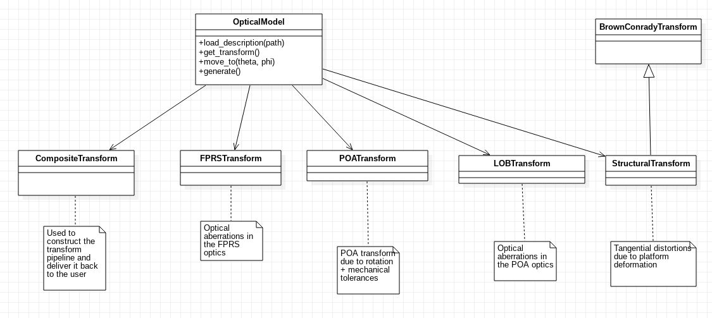

OpticalModel
^^^^^^^^^^^^
The optical model is responsible for integrating known information about the instrument that may affect the behavior of the optics between the entrance pupil and the CCD. This information may include mechanical tolerances, optical aberrations, thermal effects, etc. along with their corresponding uncertaintites. As a result, the optical model produces a coordinate transformation between the entrance pupil and the exit pupil.

	   

