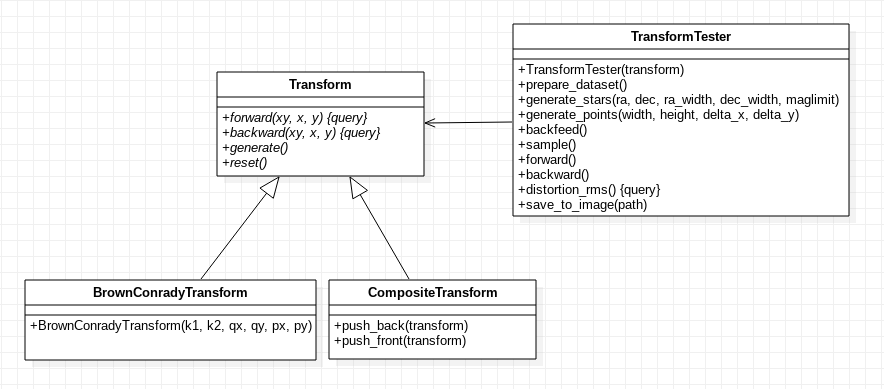

Transformation
^^^^^^^^^^^^^^
The Transformation component provides the abstraction to handle coordinate transforms between conjugate planes, assuming Gaussian optics (i.e. diffractive effects are ignored and must be modeled separately). Under this approximation, transforms are just :math:`\mathbb R^2\to\mathbb R^2` functions between coordinates.

Something as simple as a telescope with a given focal length can be modeled as a coordinate transform that multiplies the input coordinates by the inverse of the focal length. The following clases belong to the Transformation component:

.. class:: Transform

   This is the abstract class from which all other coordinate transforms are derived. If instatiated directly, it represents the identity transform. Transforms accept tuples of the form :math:`(x, y)` or :math:`N\times2` `FloatArray` arrays representing sets of :math:`N` coordinates.

   .. method:: _forward(xy)
	      
      Protected method that computes the forward transform over the :code:`ARRAY_TYPE` tuple :code:`xy` and returns a :math:`1\times2` :code:`FloatArray` containing the transformed coordinates. Non-trivial derivations of :code:`Transform` must override at least :code:`_forward` and :code:`_backward`.

   .. method:: _backward(xy)

      Protected method that computes the backward transform over the :code:`ARRAY_TYPE` tuple :code:`xy` and returns a :math:`1\times2` :code:`FloatArray` containing the transformed coordinates. Non-trivial derivations of :code:`Transform` must override at least :code:`_forward` and :code:`_backward`.

   .. method:: _forward_matrix(matrix)

      Protected method that performs :math:`N` forward coordinate transforms all at once over the coordinate list :code:`matrix` in the form of a :math:`N\times2` :code:`FloatArray` and returns the transformed coordinate list as another :math:`N\times2` :code:`FloatArray`. If not overriden by the subclass, this method simply applies :code:`_forward` along the :math:`N` rows of :code:`matrix`.

      
   .. method:: _backward_matrix(matrix)

      Protected method that performs :math:`N` backward coordinate transforms all at once over the coordinate list :code:`matrix` in the form of a :math:`N\times2` :code:`FloatArray` and returns the transformed coordinate list as another :math:`N\times2` :code:`FloatArray`. If not overriden by the subclass, this method simply applies :code:`_backward` along the :math:`N` rows of :code:`matrix`.

   .. method:: forward(xy = None, x = None, y = None)

      Public method that performs a forward transform, accepting either two scalar coordinates :code:`x` and :code:`y` or a tuple / :code:`FloarArray` of coordinates in :code:`xy`. The method automatically determines whether to use :code:`_forward` of :code:`_forward_matrix` according to the arguments passed to it.

   .. method:: backward(xy = None, x = None, y = None)

      Public method that performs a forward transform, accepting either two scalar coordinates :code:`x` and :code:`y` or a tuple / :code:`FloarArray` of coordinates in :code:`xy`. The method automatically determines whether to use :code:`_backward` of :code:`_backward_matrix` according to the arguments passed to it.

   .. method:: generate()

      In case the transform is derived from a set of parameters with uncertainties (e.g. mechanical tolerances, misalignments, precission limits in measurements), this method is called during Monte Carlo testing to initialize the specific transform parameters by drawing a sample from each parameter distribution.

   .. method:: reset()

      In case the transform holds a state (e.g. energy consumed during operation, time variation of the parameter distributions, etc), this method sets any internal state variables to their initial values.

.. class:: CompositeTransform

   The :code:`CompositeTransform` represents a chain of transforms :math:`T_{1},T_{2}, ... ,T_{n}` that are applied sequentially according to the transform direction. If :math:`T_1` represents the coordinate transform between the object plane and the rest of the chain and :math:`T_n` the transform between the rest of the chain and the object plane, the forward composite transform is simply :math:`T_{cf}=T_{nf}\circ \dots \circ T_{2f}\circ T_{1f}`. The backward transform will be :math:`T_{cb}=T_{cf}^{-1}=(T_{nf}\circ \dots \circ T_{2f}\circ T_{1f})^{-1}=T_{1f}^{-1}\circ T_{2f}^{-1}\circ \dots \circ T_{nf}^{-1}=T_{1b}\circ T_{2b}\circ \dots \circ T_{nb}`.

   .. method:: push_front(T)

      Puts the transform :code:`T` in the frontmost position of the transform chain, becoming the first transform to be computed in the forward direction.

   .. method:: push_front(T)

      Puts the transform :code:`T` in the backmost position of the transform chain, becoming the first transform to be computed in the backward direction.

.. class:: TransformTester(T)

   As new transforms are expected to be implemented in the future, a tester class :code:`TransformTester` with transform debugging functions is provided. :code:`TransformTester` is instantiated from a given transform :math:`T` and can generate a set of coordinates (the so-called *departure coordinates*), either from a regular grid or from a set of stars in the sky up to certain visual magnitude. Then, a copy of these coordinates (the *current coordinates*) can be transformed multiple times in both directions by applying :math:`T` by means of the tester API. Finally, the tester API also allows the user to measure how much the current coordinates deviate from the departure coordinates and produce image files representing these deviations. 

   
   .. image:: _static/BrownConradyTransform-distorted.png
      :width: 300
	   
   .. image:: _static/ScaleTransform-distorted.png
      :width: 300
	   
   *Images produced by TransformTester using a regular grid of points (left) and stars in the sky (right).*

   .. method:: generate_stars(ra, dec, ra_width, dec_width, maglimit)

      Initializes the departure coordinates from a set of stars in the sky enclosed in a rectangle centered in right ascension :code:`ra` and declination :code:`dec`, and dimensions :code:`ra_width x dec_width` (both of them in degrees) up to magnitude :code:`maglimit`. Right ascension is encoded in the :math:`x` coordinate and declination in the :math:`y` coordinate.

   .. method:: generate_points(width, height, delta_x, delta_y)

      Initializes the departure coordinates from a set of equally spaced points, assuming a rectangle of size :code:`width x height` with a :code:`delta_x` separation in the horizontal dimension and :code:`delta_y` separation in the vertical dimension.

   .. method:: forward()

      Applies the transform :code:`T` to the current coordinates in the forward direction and replaces them by the result of the transform

   .. method:: backward()

      Applies the transform :code:`T` to the current coordinates in the forward direction and replaces them by the result of the transform.

   .. method:: backfeed()

      Replaces the departure coordinates by the current coordinates, effectively behaving as if the tester departure points were generated from the current state.
   
   .. method:: sample()

      Call :code:`T.generate()` in order to sample the parameter distribution of the transform.

   .. method:: distortion_rms()

      Returns the root-mean-square value of the difference between the current coordinates and the departure coordinates. This value is computed as:

      .. math::
   
        E = \left[\frac{1}{N}\sum_{i=1}^N (x_i-\tilde{x}_i)^2+(y_i-\tilde{y}_i)^2\right]^{1/2}

      With :math:`(x_i, y_i)` the departure coordinates and :math:`(\tilde{x}_i,\tilde{y}_i)` the current (potentially transformed) coordinates.

   .. method:: save_to_image(path)

      Produce an image describing the result of the transformation with respect to the departure points, along with technical information like the exact sequence of applied transformations and the transform RMS.
